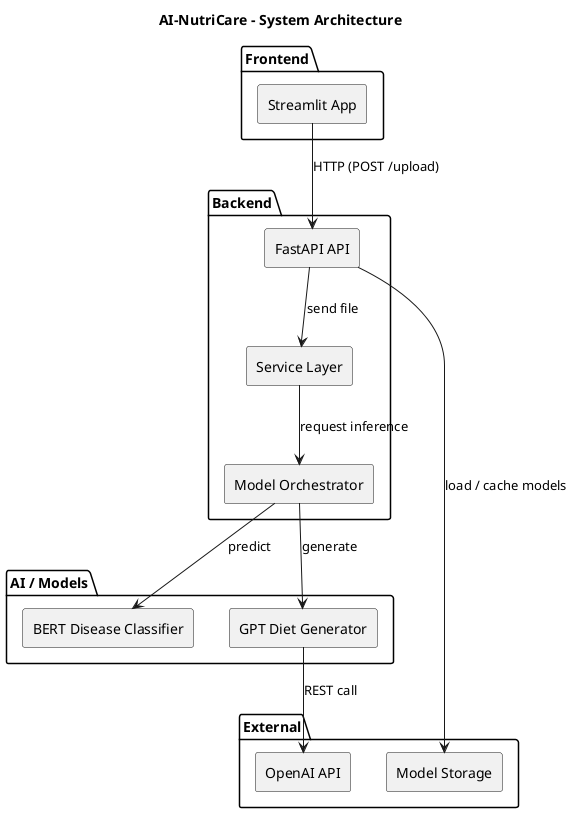
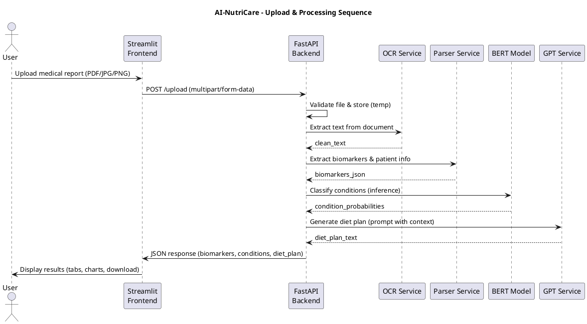
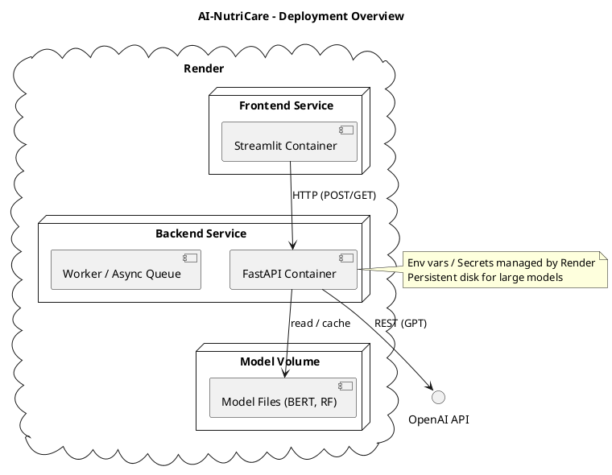

# PlantUML Prompts for AI-NutriCare

This file contains the PlantUML source prompts for the project's architecture, sequence flow, and deployment diagrams. Paste each block into a `.puml` file or a PlantUML editor to render.

## Architecture

## Sequence (Upload → Processing → Response)

## Deployment (Render + Containers)

